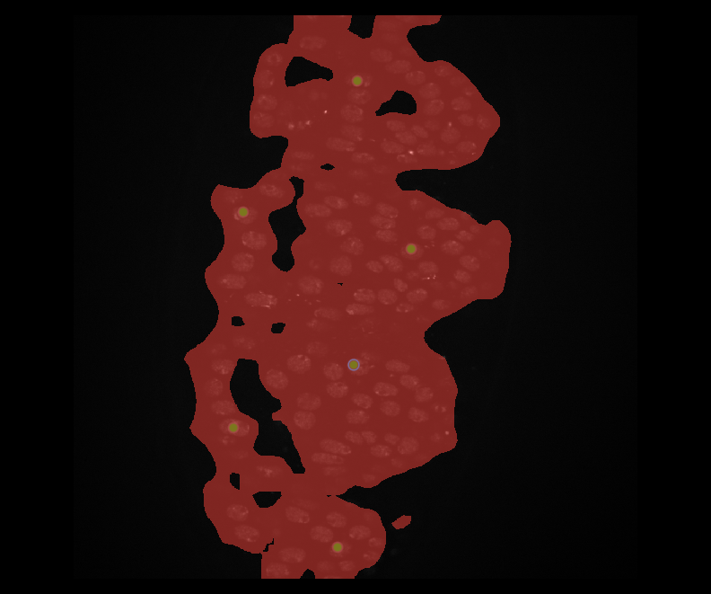

# KISA Computer Vision Assignment 10

## Authors

**Author 1 (name and surname):** Alan García Justel

**Author 1 (name and surname):** Julen Rodríguez 

## Virtual labelling

[Link to the Notebook](https://colab.research.google.com/drive/15BLlhxweXbDWCa0uIZDo5oGfuDlU19Do?usp=sharing)

**Looking at the images, why do you think it is possible to predict cell nuclei from their membrane labeling? Think about what requirements may be needed for this task or when it is not possible to learn such prediction.**

*Because it seems that nuclei's positions in the membrane-labeled image are darker spots than the membrane, this suggests that the nuclei create gaps or lower-intensity regions in the membrane signal.*

**Train a generative model to predict cell nuclei labeling from their membrane labeling in fluorescence microscopy images of Drosophila Melanogaster embryos. (This part is performed following the guidelines below).**

*The training was made taking a pretrained checkpoint and then fine-tuning it with the membrane labeling data for 10 epochs*

**Interpret the different accuracy metrics compiled along the notebook. For this, here are some questions to discuss within your team.**

- **What is the difference between SSIM, MSE, and LPIPS?**
    
    *SSIM, MSE, and LPIPS are three different metrics used to evaluate image similarity but with distinct approaches. MSE (Mean Squared Error) measures the average squared pixel-wise difference between corresponding pixels from source and target images, making it easy to compute but it isn't well-aligned with human perception. SSIM (Structural Similarity Index) improves upon MSE by considering structural information, luminance, and contrast, making it more perceptually relevant. However, it may still struggle with slight texture variations. LPIPS (Learned Perceptual Image Patch Similarity) is a deep learning-based metric that captures perceptual differences in images, making it the most human-aligned among the three. While MSE is useful for straightforward numerical comparison, SSIM and LPIPS provide more insightful assessments of image quality, especially when human perception matters.*
    
- **Are hallucinations an important issue in this case?**
    
    *Hallucinations refer to the generation of false or misleading details in AI-generated content. In this case, they are a significant issue, as the model may produce fake nuclei, leading to incorrect data for further analysis. Therefore, minimizing hallucinations is a crucial factor when developing these types of models.*
    
- **Are the previous metrics capable of identifying hallucinations?**
    
    *SSIM and MSE might fail to detect such hallucinations properly, as they focus on pixel-wise and structural differences rather than perceptual realism. LPIPS, being based on deep network features, could be more sensitive to hallucinated textures but might still struggle if the hallucinations are perceptually plausible. In this case, the LPIPS map between the target and predicted images makes it easy to identify areas where the model generates hallucinations, which are not as clearly detected with SSIM.*

**What would you take into consideration to determine whether this is a good or a bad method?**

*When evaluating a method for generating nucleus images from membrane images, several factors must be considered. The generated images should be visually realistic and accurately represent nuclei's structure, assessed through metrics like LPIPS, SSIM, and expert review. The method must preserve key biological features, such as shape, size, and boundaries, and align with ground truth annotations for reliable segmentation. It should also handle variations in membrane images (e.g., noise or lighting) and be computationally efficient for large datasets or real-time use.*

- **What actions would you propose to improve the results?**
    *We suggest actions like data augmentation with changes in size, orientation, contrast, and adding noise to make the model more robust. Including domain knowledge can help improve biological accuracy, and using post-processing methods can refine the results. Modifying loss functions to include perceptual loss will help the model focus on important features. Cross-validation and real-world annotations will ensure the model is reliable, and hybrid models can improve the accuracy of nucleus shape and boundaries. These strategies should improve the quality, accuracy, and generalizability of the generated nucleus images.*

## Zero-shot nuclei segmentation using DinoSIM

**In this exercise you will try to segment the same image using different resolutions. When does the network perform better at segmenting cell nuclei? Why do you think the results are different?**

  
  
  
  

*The network gives better results with the high resolution images. Here, each cell nucleus is represented by more pixels, allowing the model to capture more details and features. These additional pixel information provides a clearer and more discriminative representation of each nucleus, resulting in segmentation masks that closely follow the true boundaries. In contrast, low resolution images tend to blur these features. It causes the model to mix adjacent nuclei and produce less precise results.*

**Assess how the results of DinoSIM change with different number of prompts (1, 2, 3, … points). Do the results improve when you increase the number of points? Does it converge?**

  
  
  
  

*Having only one single prompt can lead the model to underfit or overfit the segmentations. It must be a really good prompt that fully capture the variation in intensity or shape in order to have good results. Adding more prompts generally returns more complete and precise segmentation masks, especially if each new prompt highlights a part of the nucleus that was previously underrepresented.*
*Adding prompts does tend to converge. If there are multiple prompts that cover all the possible features the nuclei may have, further prompts will not change the segmentation results.*

**Try different results of DinoSIM with one single prompt by changing its location. Why do you think it sometimes performs better than others?**

  
  
  

  
  
  

*As explained before, when a single prompt is used, the model extracts the features from that specific prompt and searches for similar patterns. If the prompt capture good information of the nuclei, then the segmentation will often generalize well. Each prompt acts like a template. It is important to place the prompts in informative spaces and not in noisy and unusable areas.*

**You will segment a virtually generated image using the reference vectors calculated from prompts in the original image. What are the main differences you see? Why do you think it may happen? Do you think you could use the results in the original and in the fake image to evaluate the quality of the virtual staining?**

  
  
  
  

  
  
  
  

*Applying the same reference vectors in both image types return different segmentation. In some cases, the virtual images show clearer contrast, resulting in segmentation that looks more defined and consistent. In other cases, the model may fail to capture certain nuclei because this virtual images may introduce different intensity patterns that differ significantly from the original images.*
*This happens because the model relies on patch-based feature similarity from the original images prompts. Accurate segmentation happen when the virtual images have real features. This can be really useful to evaluate. The closer the segmentation results on fake images match real ones, the better the virtual staining preserves true cellular morphology.*

**This is a research project still in progress. Any feedback provided by means of GitHub issues or comments will be positively considered for the final grade.**

*The repository is well organized and easy to install. Using Napari makes it easy to use the model. The idea of using pre-trained models for zero shot segmentation is really useful. Although this positive aspects, it would be a great improvement to have lots of different examples and comparison with real and fake images.*

### 3D versus 2D analysis

**What do you think are the benefits and drawbacks of each approach? Think about the size of the data and the parameters of the network, as well as the annotation and the computation of accuracy metrics. What about LPIPS in 3D?**

*Using low resolution images has the benefit of reducing data size and computational load, allowing for faster processing and lower memory usage. However, this cost the loss of details, which can lead to worse results because the network might not capture the differences between the nuclei and noise. Upscaled images, on the other hand, provide more details that allow to extract more discriminative features, but requires more computational power and memory and the network parameters may need to be adjusted to handle the increased data size effectively.*
*This approach minimizes manual annotation effort but the accuracy heavily depends on where the prompts are placed. More prompts improve the segmentation until a convergence point. Standard accuracy metrics may not fully capture the perceptual quality of the segmentation, which is why Learned Perceptual Image Patch Similarity (LPIPS) can be interesting. This metric provides a measure of perceptual similarity that aligns well with human judgments, but extending it to 3D data introduces significant computational and network design complexity.*
